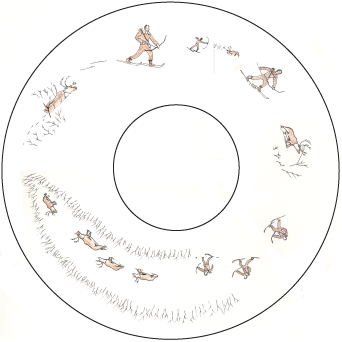

# Upper Inlet Dena’ina and This Project

The Upper Inlet dialect of Dena’ina is the traditional language of the
Upper Cook Inlet Basin, including at the communities of Tyonek,
Knik, and Eklutna. These language lessons were adapted from
lessons developed by the Yukon Native Language Centre and were
recorded with Sava Stephan in Anchorage in February, 1999 by James Kari. This
publication is produced by the Dena’ina Language Program of the
Alaska Native Heritage Center. James Kari would like to thank Sava Stephan,
Isaac Stephan, Donita Peter, and Jon Ross for their help and
encouragement. Web adaptation and design by

## Sava Stephan, Sr.

Sava Stephan was born in 1920 in Susitna Station. Sava grew up speaking the Dena’ina language. He moved to Tyonek in 1934 along with most of the residents of Susitna Station. Sava has worked and traveled throughout the Susitna and Tyonek areas, and today he is the recognized expert on Upper Inlet Dena’ina.

As a teacher, storyteller and singer Sava has made an enormous contribution to Dena’ina language and culture. He was a major contributor to the 2003 edition of <i>Shem Pete’s Alaska</i> (University of Alaska Press). He continued to be engaged in Dena'ina language work in his later life until his passing in 2013.

{: .text-center }
Listen to a message from Sava Stephan <a href="message.html">here</a>.
% [Common Expressions](){: .btn .btn-green  }

## Credits
Originally published in 2004 as a CD-ROM and booklet by the [Alaska Native Language Center](http://www.uaf.edu/anlc)
and the Dena'ina Archiving, Access and Training Project, with funding from the National Science Foundation.
[Alaska Native Heritage Center](http://www.alaskanative.net). 
Original web version by <a href="http://www.lostplot.net">Megan Thornley</a>, with revisions by Gary Holton. % copyright &copy; 2005 Dena'inaq' Titaztunt. 

% 
% The materials on this site were originally produced as part of the *Tanacross Phrase and Conversation Lessons*, published in 2003 as a booklet with accompanying compact disc. The original book and CD set is available for purchase from the  the [Alaska Native Language Center](https://epay.alaska.edu/C21563_ustores/web/product_detail.jsp?PRODUCTID=5708&SINGLESTORE=true).

